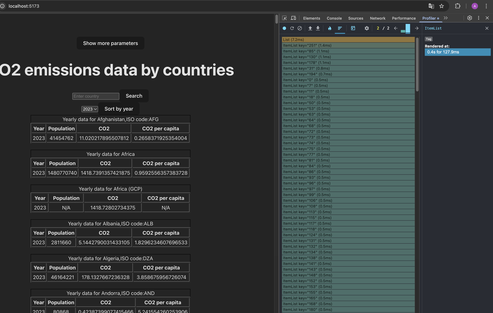
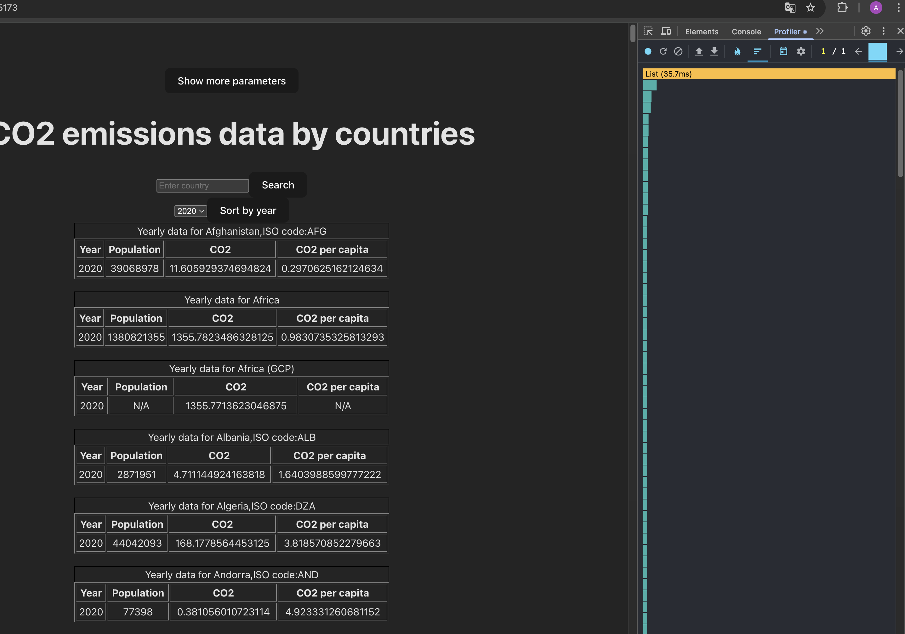
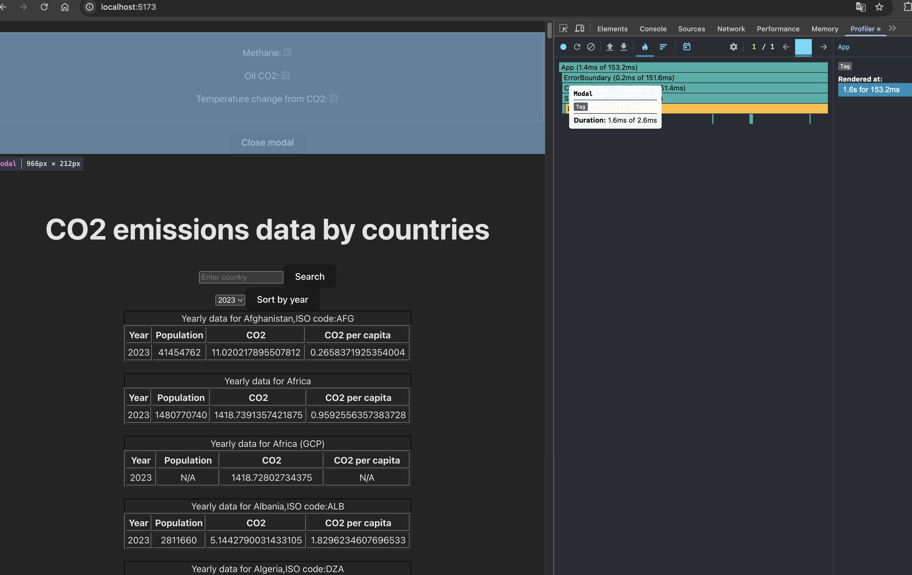
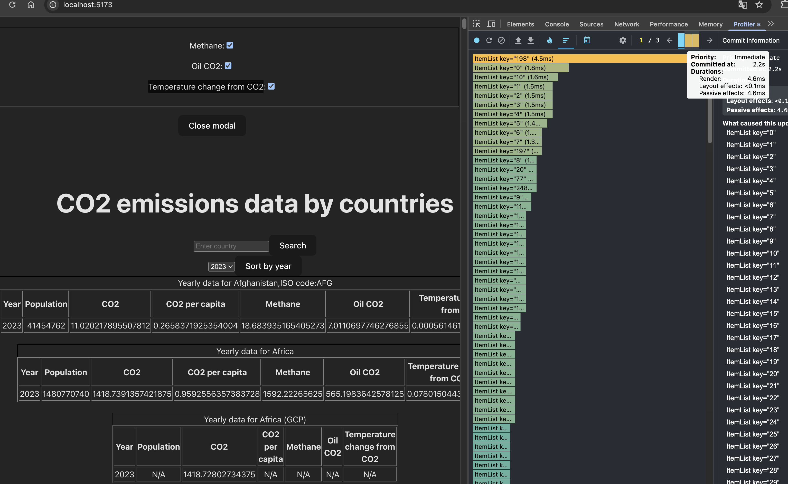
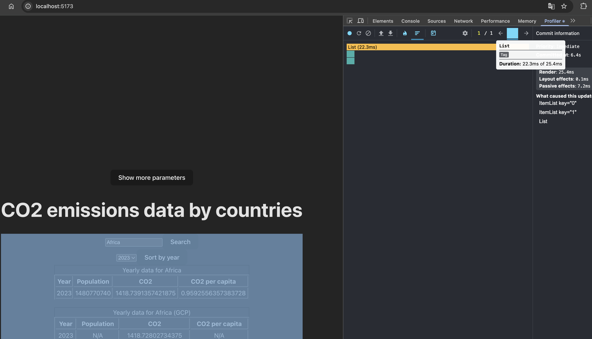

Initial Profiling with React Dev Tools Profiler:

Durations first render :
- Full app : 127,9 ms;
- List component: 7.2ms;
- ItemList components: first 6( 0,7ms - 1,4ms ), rest ItemList 0,5ms;

Upadate data in list after change year: 35,7 ms;

Open modal window: 1,6ms;

Add methane columns: oil_co2, Temperature change from CO2 (4,6ms + 2,6ms + 3,2ms);

Show data after searching:  22,3ms;

